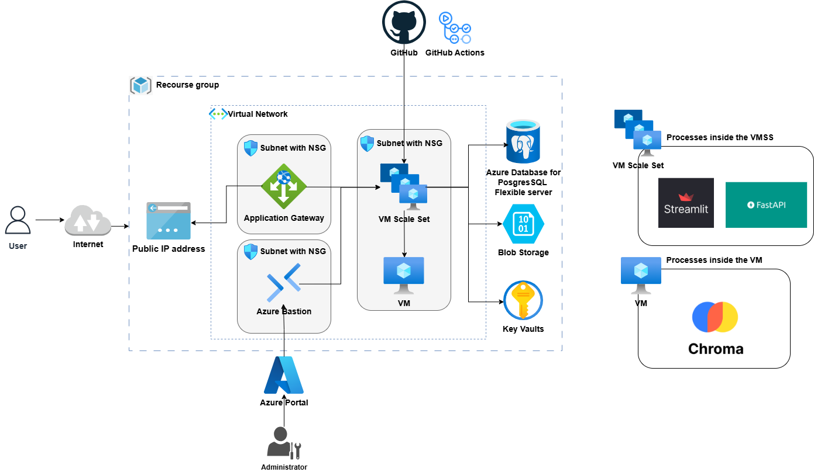

# Cloud Infrastructure & Automated Deployment for RAG Chatbot

## 📋 Prerequisites

- Active Azure Subscription
- Terraform installed locally
- Authenticated Azure CLI session

----------

## ✨ Key Features

- PDF document ingestion for targeted querying
- Highly scalable and secure cloud infrastructure on Azure
- Infrastructure as Code (IaC) configuration via Terraform
- Complete implementation lifecycle for production-ready AI applications

----------

## 📖 Project Overview

This repository automates the setup and deployment of a **Retrieval-Augmented Generation (RAG) Chatbot** on **Microsoft Azure** utilizing **Terraform**.

The system relies on:

- **Streamlit** for the frontend user experience
- **FastAPI** for core backend operations
- **ChromaDB** as the vector store to query uploaded PDF documents
- **PostgreSQL** for persistent data management

Users can engage in regular text interactions while also uploading documents to query specific content contextually.

----------

## 💬 Application Architecture

An integrated RAG ecosystem powered by **Streamlit** and **FastAPI**.

- Users can upload files and chat dynamically.
- The Chroma vector store extracts context from documents.
- Responses are accurately grounded in the provided files.
- Integrates multiple layers:
  - **Streamlit** (UI)
  - **FastAPI** (Backend)
  - **PostgreSQL** (Database)

> ⚡ Note: While vector embeddings are utilized, the focus of this repository is streamlined cloud deployment.


----------

## 🏗️ Cloud Infrastructure Architecture

The provisioned Azure environment includes:

- **Virtual Network (VNet)** with segmented subnets.
- **Application Gateway** for handling and routing traffic.
- **Azure Bastion** for secure virtual machine management.
- **VM Scale Sets (VMSS)** running the frontend and backend services.
- **Virtual Machine** dedicated to ChromaDB.
- **PostgreSQL Database** instance.
- **Key Vault** for secret and configuration management.
- **Network Security Groups (NSGs)** for access control.

### 🖼️ Infrastructure Architecture Diagram



----------

## 🚀 Deployment Steps

1. Clone the repository:
```bash
git clone [https://github.com/your-username/your-repo-name.git](https://github.com/your-username/your-repo-name.git)
cd Chatbot-Project-Terraform

Generate SSH keys for the VM:

mkdir -p ssh-keys
ssh-keygen -t rsa -b 4096 -f ssh-keys/terraform-azure -N ""
chmod 400 ssh-keys/terraform-azure

Generate SSH keys for the VMSS:

ssh-keygen -t rsa -b 4096 -f ssh-keys/terraform-azure-vmss -N ""
chmod 400 ssh-keys/terraform-azure

Populate the terraform.tfvars configuration:

subscription_id = "<YOUR_SUBSCRIPTION_ID>"
source_image_id = "<YOUR_IMAGE_ID>"
openai_key = "<YOUR_OPENAI_KEY>"

⚡ Note: Variable names can be customized to match your setup.

Initialize Terraform:
terraform init
Plan infrastructure changes:
terraform plan
Apply the configuration:
terraform apply --auto-approve
⚡ Note: The --auto-approve flag is optional.

Access the Chroma VM via remote SSH:
Host chromaVm
HostName <PUBLIC_IP_ADDRESS_OF_THE_VM>
IdentityFile <PATH_TO_THE_PRIVATE_KEY>
User azureuser

Create and execute the setup.sh script on the Chroma VM. The script expects 7 arguments:
PAT_token: GitHub personal access token.
repo_url: Repository URL (without https://).
branch_name: Target branch name.
db_host: Database host address.
target_db: Database name.
db_username: Server username.
db_password: Server password.

bash setup.sh <PAT_token> <repo_url> <branch_name> <db_host> <target_db> <db_username> <db_password>
 #!/bin/bash

if [ $# -ne 7 ]; then
    echo "Usage: $0 <PAT_token> <repo_url> <branch_name> <db_host> <target_db> <db_username> <db_password>"
    exit 1
fi

PAT_TOKEN="$1"
REPO_URL="$2"
BRANCH_NAME="$3"
DB_HOST="$4"
TARGET_DB="$5"
DB_USERNAME="$6"
DB_PASSWORD="$7"
REPO_NAME=$(basename "$REPO_URL" .git)
USER=$(whoami)
HOME_DIR=$(eval echo ~$USER)

echo "Setting up database..."
psql "host=$DB_HOST port=5432 dbname=$TARGET_DB user=$DB_USERNAME password=$DB_PASSWORD sslmode=require" \\
    -c "CREATE TABLE IF NOT EXISTS advanced_chats (
        id TEXT PRIMARY KEY,
        name TEXT NOT NULL,
        file_path TEXT NOT NULL,
        last_update TIMESTAMP DEFAULT CURRENT_TIMESTAMP,
        pdf_path TEXT,
        pdf_name TEXT,
        pdf_uuid TEXT
    );"

echo "Setting up conda environment..."
source "$HOME_DIR/miniconda3/etc/profile.d/conda.sh"
if ! conda env list | grep -q "^project "; then
    conda create -y -n project python=3.11
fi

echo "Cloning repository..."
cd "$HOME_DIR"
if [ -d "$REPO_NAME" ]; then
    echo "Directory already exists."
    exit 1
fi
export GITHUB_TOKEN="$PAT_TOKEN"
git clone -b "$BRANCH_NAME" "https://${GITHUB_TOKEN}@${REPO_URL}"
cd "$REPO_NAME"

if [ -f requirements.txt ]; then
    "$HOME_DIR/miniconda3/envs/project/bin/pip" install -r requirements.txt
fi

echo "Creating systemd services..."
cat <<EOF | sudo tee /etc/systemd/system/chromadb.service
[Unit]
Description=ChromaDB
After=network.target

[Service]
Type=simple
User=$USER
WorkingDirectory=$HOME_DIR/$REPO_NAME
ExecStart=$HOME_DIR/miniconda3/envs/project/bin/chroma run --host 0.0.0.0 --path $HOME_DIR/$REPO_NAME/chroma_db
Restart=always

[Install]
WantedBy=multi-user.target
EOF

echo "Reloading systemd and starting services..."
sudo systemctl daemon-reload
sudo systemctl enable chromadb
sudo systemctl start chromadb

echo "Setup completed successfully"

Check if the chromadb service is running in host 0.0.0.0:8000
sudo systemctl status chromadb.service
